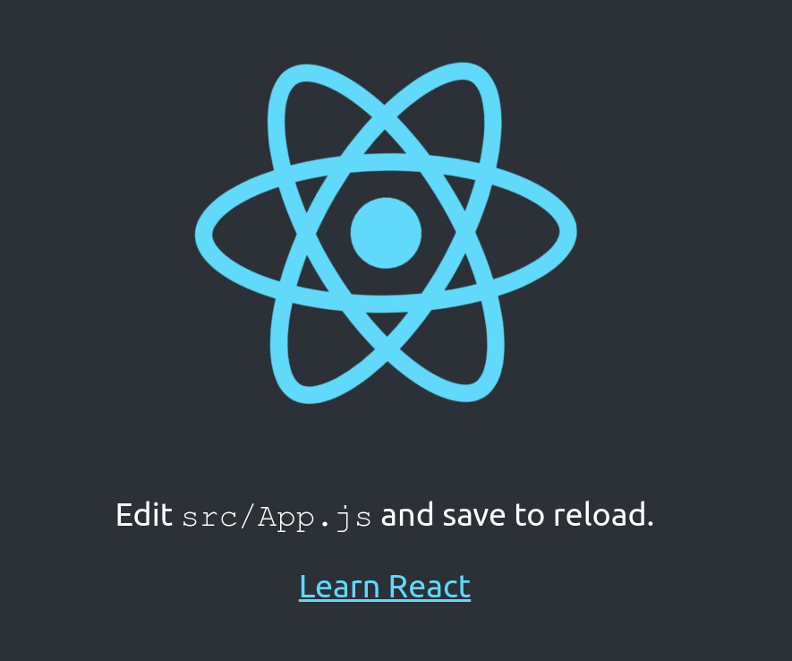

## Introduction

Hello! Thanks for stopping by and taking time to read our blog; we appreciate you!

REACT INTRO

## React

React was created by Jordan Welke, a software engineer at Facebook, and first used on Facebook's newsfeed page in 2011. Welke created React after being "influenced by XHP which is an HTML component framework for PHP" (React History Wikipedia). I've never used XHP, or PHP for that matter, so I can't speak to how those technologies work but I have used React and Mr. Welke was on to something. React applications are built using reusable components; these components are the building blocks that, when combined, form the application. I like to think of these components as Legos on steroids. You can take a whole bunch of Lego bricks, put them together, and build the Batmobile, a castle, the Empire State building, or anything else your mind can imagine. But I think we've all had the experience of build a Lego set and wishing we had just one or two more soldiers to complete the set. Well with React you don't have to worry! You can code a component once and use it as many times anywhere else inside your application. That means if you create a cool data table you can use it anywhere inside your application.

## Hello World

Alrighty, so now that we know a little bit about React I want to start off with the classic and timeless Hello World example so we can see the simplest form of a React application. From there we will create a few simple components to demonstrate what I like to call *The Lego Effect!* (dramatic and corny I know...) and learn about how React works. Let's begin!

### Installing the React CLI Tool

Getting started with a React project has been made effortless thanks to the `create-react-app` command line tool. Let's get ourselves up and running so we can see how React works!

Fire up your favorite terminal and type in the following: `npm -i -g create-react-app` or `yarn global add create-react-app` if you're a `yarn` dude or dudette. This will install the `create-react-app` command line tool which will allow you to easily install boilerplate and start a new React project. The `create-react-app` CLI is really awesome so if you'd like to learn more about it click [here](https://github.com/facebookincubator/create-react-app). After you have installed the CLI tool navigate to a directory where you'd like to start your project. In our case you can enter the following in your terminal: `cd /Documents && create-react-app hello-world-react`. This will create a folder called `hello-world-react` in your Documents directory. Now navigate into `hello-world-react` directory and install all the dependencies using `npm i` or `yarn install`. After the dependencies are installed run the following command in your terminal (make sure you're still in the `hello-world-react` folder): `npm run start`. This will build the app and open your internet browser. If all went according to plan you should see the image below.

## React and the DOM

For the purpose of this section we'll only be concerned with the following files:

- `index.html` in the public folder
- `App.js` in the src folder
- `index.js` in the src folder

The `index.html` you may be familiar with; it's the skeleton of any web application. Notice the `
`, this is where the magic begins to happen. Now take a look at the `index.js` file, specifically the line of code that reads `ReactDOM.render(<App />, document.getElementById('root'));`. This ReactDOM render function is a special React function that takes your `<App />` component and tells the DOM to append it to the `
` and render it. Under the hood React is converting your component logic and JSX into JavaScript and HTML code which the DOM can understand. It is also creating a Virtual DOM, or V-DOM, which is a node tree just like the real DOM. The major difference is that the V-DOM node tree will respond to mutations in data and trigger a re-rendering of components to reflect the changes in the data. If you'd like to learn more about the V-DOM check out[this post](https://reactjs.org/docs/faq-internals.html) from the React site.

## Templating in React

So far we know how to install React and how it's working with the DOM. Now let's check out how we can get some cool stuff to display on the page. Open up the `App.js` file and check out line 5. Due to the awesomeness of JavaScript's object inheritance model we can make a new object that inherits the properties and values of a parent object. In our case we are creating an object called `App` whose parent is `Component`. This means our `App` class will have some special functionality like the `render()` method.

- What the render method does
- 
## *The Lego Effect*

- With your components
- With node_module components

## Ideas

- JSX
- Props and State
- className vs class
- Functional components
- Scoped CSS
- Lifecycle Hooks

## Closing Statements

If you'd like to play around with the code from this article you can head to our [GitHub page](https://github.com/itsatechblog), clone the repo, and have some fun!

Maybe a follow up article about state management (Redux) and React Routing?

## Resources

- [React Vue Cover Image](https://jelvix.com/images/blog/5a98507190fe4.jpg)
- [React History Wikipedia](https://en.wikipedia.org/wiki/React_(JavaScript_library)#History)
- [`create-react-app`](https://github.com/facebookincubator/create-react-app)