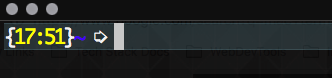
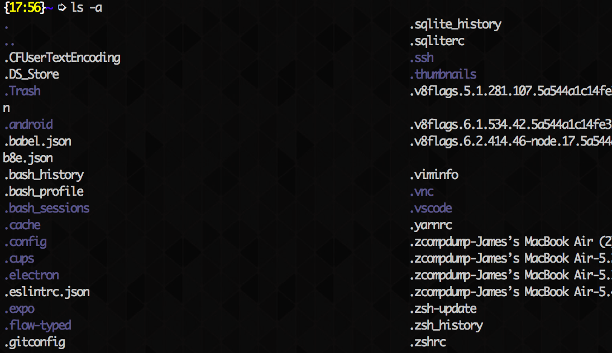

## Introduction

If you're reading this chances are you are very much like me: lazy and proud! Aliases are a great way for us lazy developers to minimize the number of keystrokes required to execute commands in the terminal and thus streamline our work and increase our productivity. Instead of executing `git checkout -b NewFeatureBranch` you could instead execute `gcb NewFeatureBranch`. Aliases are completely custom and can either be temporary or saved in your terminal's run commands, or `rc`, file. This article will cover creating commands in a Bash based terminal so this guide will theoretically work with all Mac computers and most, if not all, Linux based systems. Let's get started!

## Finding the Configuration File

Alright, let's fire up the terminal and find our `rc` file. If you are using Bash you will be looking for the `.bashrc` file and if you're using ZSH you will be looking for the `.zshrc` file. If you are using a shell other than Bash or ZSH go ahead and visit the shells website to find out what the run commands filename is called but most likely it will look something like `.[SHELLNAME]rc`.

In your terminal navigate to your home directory by typing `cd`. You'll know you're there if you see a `~`. It should look similar to the image below.

Now type in `ls -a` to list all of the files in the root directory. We need to add the `-a` flag to list both hidden and non-hidden files. We should see our `rc` file somewhere in this list. I am using a ZSH shell so my `rc` file is named `.zshrc`.

Now open this file with Vim: `vim .zshrc`, Nano: `nano .zshrc`, or your favorite text editor. I am going to open it with VSCode because why not! Type in `code .zshrc` to open the file in VSCode. You can now edit this file but be careful! We don't want to mess anything up because this file will run every time we open an instance of our terminal.
